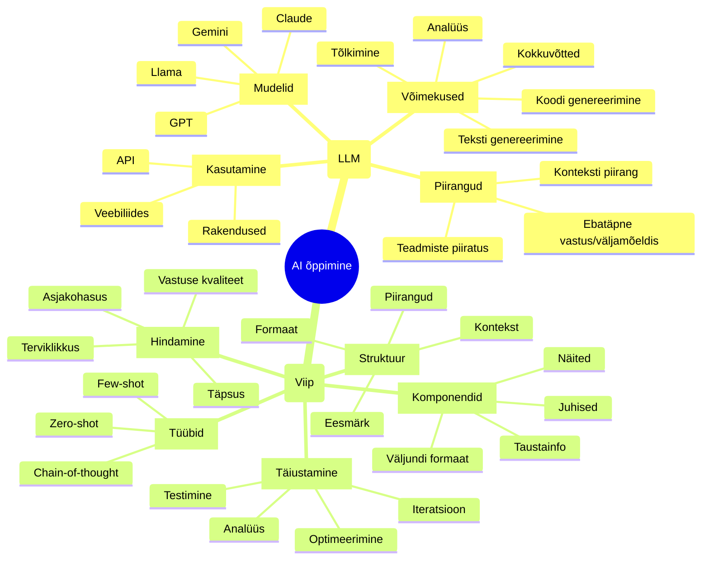
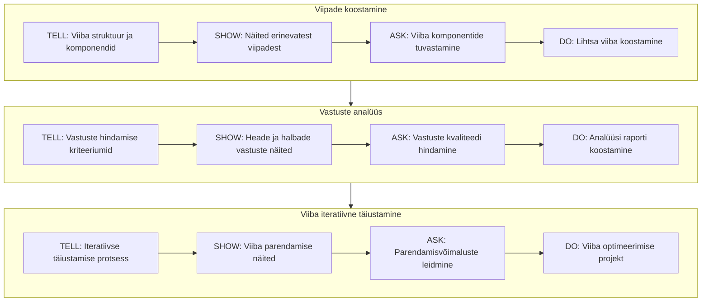
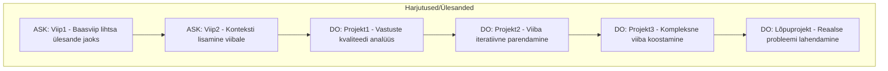

# LLM viipade õppetüki kava

## Õpiväljundid
**Õppetüki läbinu:**
- koostab efektiivseid viipe;
- analüüsib LLM vastuseid;
- täiustab viipe iteratiivselt;
- rakendab viipade koostamise parimaid praktikaid

## Mõistekaart


graph TB
   %% Peamine sõlm
   AI[AI õppimine]

   %% LLM põhiharu
   LLM[LLM]
   M[Mudelid]
   V[Võimekused]
   P[Piirangud]
   K[Kasutamine]

   %% LLM alamharud
   M1[GPT]
   M2[Claude]
   M3[Llama]

   V1[Tekstigenereerimine]
   V2[Analüüs]
   V3[Tõlkimine]
   V4[Kokkuvõtted]

   P1[Hallutsinatsioonid]
   P2[Konteksti piirang]
   P3[Ajaline piir]

   K1[API]
   K2[Veebiliides]
   K3[Rakendused]

   %% Viip põhiharu
   VIIP[Viip]
   S[Struktuur]
   T[Tüübid]
   KO[Komponendid]
   TA[Täiustamine]
   H[Hindamine]

   %% Viip alamharud
   S1[Kontekst]
   S2[Eesmärk]
   S3[Piirangud]
   S4[Formaat]

   T1[Zero-shot]
   T2[Few-shot]
   T3[Chain-of-thought]

   KO1[Taustinfo]
   KO2[Juhised]
   KO3[Näited]
   KO4[Väljundi formaat]

   TA1[Iteratsioon]
   TA2[Analüüs]
   TA3[Optimeerimine]
   TA4[Testimine]

   H1[Vastuse kvaliteet]
   H2[Täpsus]
   H3[Asjakohasus]
   H4[Terviklikkus]

   %% Põhiühendused
   AI --> LLM
   AI --> VIIP

   %% LLM ühendused
   LLM --> M
   LLM --> V
   LLM --> P
   LLM --> K

   M --> M1
   M --> M2
   M --> M3

   V --> V1
   V --> V2
   V --> V3
   V --> V4

   P --> P1
   P --> P2
   P --> P3

   K --> K1
   K --> K2
   K --> K3

   %% Viip ühendused
   VIIP --> S
   VIIP --> T
   VIIP --> KO
   VIIP --> TA
   VIIP --> H

   S --> S1
   S --> S2
   S --> S3
   S --> S4

   T --> T1
   T --> T2
   T --> T3

   KO --> KO1
   KO --> KO2
   KO --> KO3
   KO --> KO4

   TA --> TA1
   TA --> TA2
   TA --> TA3
   TA --> TA4

   H --> H1
   H --> H2
   H --> H3
   H --> H4

   %% Ristseosed
   VIIP -.-> K
   KO -.-> V
   H -.-> V2
   TA2 -.-> H
   S -.-> P
```

## Tegumite struktuur – viipade koostamine, vastuste analüüs ja viiba iteratiivne täiustamine

## Harjutused

## Tegumid
- Tegum1: [Viipade koostamine](./tegum1.md)
- Tegum2: [Vastuste analüüs](./tegum2.md)
- Tegum3: [Viiba iteratiivne täiustamine](./tegum3.md)

## Harjutused
- [Harjutus 1: Baasviiba koostamine](./harjutused.md#harjutus-1-baasviiba-koostamine)
- [Harjutus 2: Viiba konteksti täiendamine](./harjutused.md#harjutus-2-viiba-konteksti-täiendamine)
- [Harjutus 3: Viipade vastuste analüüs](./harjutused.md#harjutus-3-viipade-vastuste-analüüs)

## Projektid
- [Projekt 1: EL Projekti kavandi koostamine viipade abil](./projektid.md#projekt-1-el-projekti-kavandi-koostamine-viipade-abil)
- [Projekt 2: Viipade iteratiivne täiustamine](./projektid.md#projekt-2-viipade-iteratiivne-täiustamine)
- [Projekt 3: Kompleksne viiba koostamine](./projektid.md#projekt-3-kompleksne-projektikoostamine)
- [Lõpuprojekt: Reaalse probleemi lahendamine viipade abil](./projektid.md#lõpuprojekt-reaalse-projektitaotluse-koostamine)

## Juhend õpetajale
- Järgi TELL→SHOW→ASK→DO mustrit
- Alusta lihtsamatest ülesannetest
- Igal sammul kontrolli õpiväljundite saavutamist
- Kasuta praktilisi näiteid
- Lisa interaktiivseid elemente

**Hindamine:**
- ASK harjutused: enesekontroll või vastastikune hindamine
- DO ülesanded: õpetaja hindab
- Lõpuprojekt: põhjalik tagasiside

**Ajaline planeering:**
- Nädal 1: Tegum 1 - Promptide koostamine
    - TELL & SHOW: 45 min
    - ASK & DO: 45 min

- Nädal 2: Tegum 2 - Vastuste analüüs
    - TELL & SHOW: 45 min
    - ASK & DO: 45 min

- Nädal 3: Tegum 3 - Prompti iteratiivne täiustamine
    - TELL & SHOW: 45 min
    - ASK & DO: 45 min

- Nädal 4: lõpuprojekt


