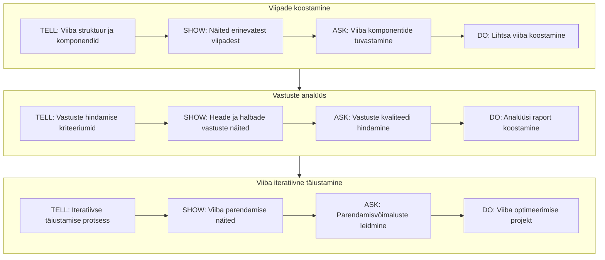
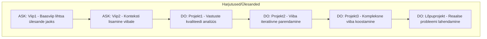

# LLM viipade õppetüki kava

## Õpiväljundid
- Koostab efektiivseid viipe
- Analüüsib LLM vastuseid
- Täiustab viipe iteratiivselt
- Rakendab viipade koostamise parimaid praktikaid

## Struktuur

## Harjutused

## Tegumid
- Tegum1: [Viipade koostamine](./tegum1.md)
- Tegum2: [Vastuste analüüs](./tegum2.md)
- Tegum3: [Viiba iteratiivne täiustamine](./tegum3.md)

## Juhend õpetajale
- Järgi TELL→SHOW→ASK→DO mustrit
- Alusta lihtsamatest ülesannetest
- Igal sammul kontrolli õpiväljundite saavutamist
- Kasuta praktilisi näiteid
- Lisa interaktiivseid elemente

**HINDAMINE:**
- ASK harjutused: Enesekontroll või vastastikune hindamine
- DO ülesanded: Õpetaja hindab
- Lõpuprojekt: Põhjalik tagasiside

