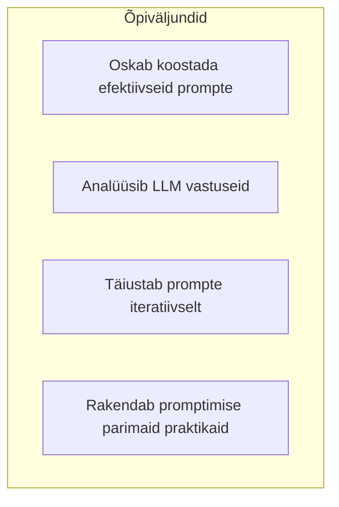
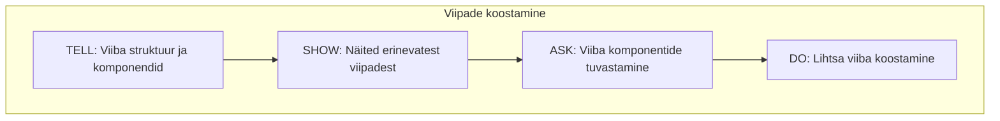
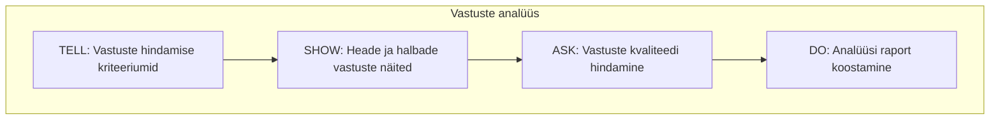
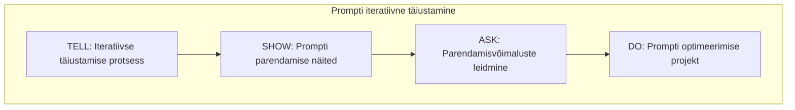
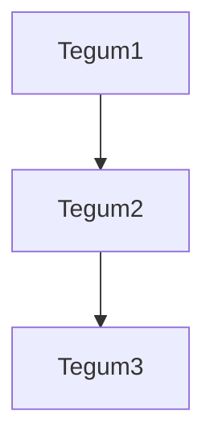
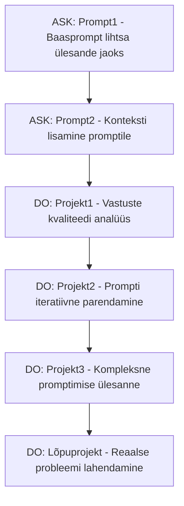

## Õpiväljundid

```mermaid
flowchart TB
    subgraph Õpiväljundid
    v1[Oskab koostada efektiivseid prompte]
    v2[Analüüsib LLM vastuseid]
    v3[Täiustab prompte iteratiivselt]
    v4[Rakendab promptimise parimaid praktikaid]
    end
```

## Viipade koostamine

```mermaid
flowchart TB
    subgraph Tegum1[Viipade koostamine]
    t1[TELL: Viiba struktuur ja komponendid]
    t2[SHOW: Näited erinevatest viipadest]
    t3[ASK: Viiba komponentide tuvastamine]
    t4[DO: Lihtsa viiba koostamine]
    t1 --> t2 --> t3 --> t4
    end
```
## Vastuste analüüs

```mermaid
flowchart TB
    subgraph Tegum2[Vastuste analüüs]
    a1[TELL: Vastuste hindamise kriteeriumid]
    a2[SHOW: Heade ja halbade vastuste näited]
    a3[ASK: Vastuste kvaliteedi hindamine]
    a4[DO: Analüüsi raport koostamine]
    a1 --> a2 --> a3 --> a4
    end
```
## Viiba iteratiivne täiustamine

```mermaid
flowchart TB
    subgraph Tegum3[Prompti iteratiivne täiustamine]
    i1[TELL: Iteratiivse täiustamise protsess]
    i2[SHOW: Prompti parendamise näited]
    i3[ASK: Parendamisvõimaluste leidmine]
    i4[DO: Prompti optimeerimise projekt]
    i1 --> i2 --> i3 --> i4
    end
```
## Ülesanded

```mermaid
flowchart TB
    Tegum1 --> Tegum2 --> Tegum3
```

```mermaid
flowchart TB
    h1[ASK: Prompt1 - Baasprompt lihtsa ülesande jaoks]
    h2[ASK: Prompt2 - Konteksti lisamine promptile]
    h3[DO: Projekt1 - Vastuste kvaliteedi analüüs]
    h4[DO: Projekt2 - Prompti iteratiivne parendamine]
    h5[DO: Projekt3 - Kompleksne promptimise ülesanne]
    h6[DO: Lõpuprojekt - Reaalse probleemi lahendamine]
    h1 --> h2 --> h3 --> h4 --> h5 --> h6
```