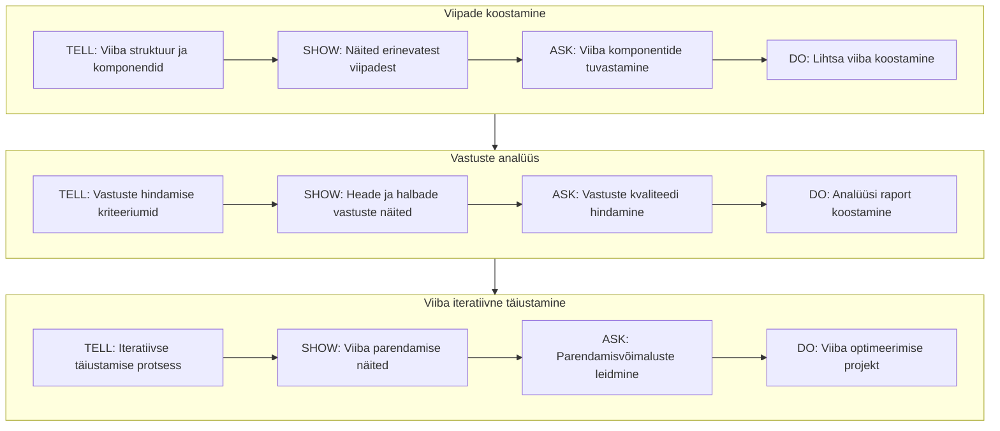
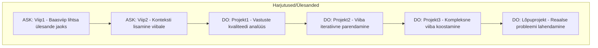

# Keelemudelitele viipade koostamine
## Õpiväljundid
Kursuse läbinu:
- Koostab efektiivseid viipasid
- Analüüsib keelemudelite vastuseid
- Täiustab viipa iteratiivselt
- Rakendab viipade koostamise parimaid praktikaid

## Harjutused

### Selgitused (ASK):

**"Baasviip"** - koostab lihtsa viiba etteantud ülesande põhjal

Raskusaste: **kerge**  
Seotud tegumiga: **Viipade koostamine**

**"Konteksti lisamine"** - täiendab olemasolevat viipa asjakohase kontekstiga

Raskusaste: **keskmine**  
Seotud tegumiga: **Viipade koostamine**

### Ülesanded (DO):

**"Vastuste analüüs"** - analüüsib viie erineva viiba vastuseid, koostab võrdlustabeli

Raskusaste: **keskmine**  
Seotud tegumiga: Vastuste analüüs

**"Iteratiivne parendamine"** - võtab ühe viiba ja täiustab seda vähemalt kolm korda

Raskusaste: **keskmine-raske**  
Seotud tegumiga: Viipade iteratiivne täiustamine

"Kompleksne viipade koostamine" - lahendab keerukama ülesande, mis nõuab mitme viiba kombineerimist

Raskusaste: **raske**  
Seotud tegumiga: **kõik tegumid**

**  "Lõpuprojekt"** - valib reaalse probleemi ja lahendab selle LLM abil

Raskusaste: **väga raske**  
Seotud tegumiga: kõik tegumid