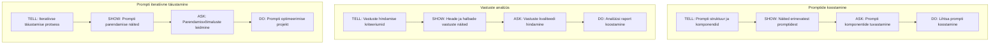

## Õpiväljundid
    - Koostab efektiivseid viipasid
    - Analüüsib LLM vastuseid
    - Täiustab prompte iteratiivselt
    - Rakendab promptimise parimaid praktikaid

```mermaid
flowchart TB
    subgraph Tegum1[Promptide koostamine]
    t1[TELL: Prompti struktuur ja komponendid]
    t2[SHOW: Näited erinevatest promptidest]
    t3[ASK: Prompti komponentide tuvastamine]
    t4[DO: Lihtsa prompti koostamine]
    t1 --> t2 --> t3 --> t4
    end

    subgraph Tegum2[Vastuste analüüs]
    a1[TELL: Vastuste hindamise kriteeriumid]
    a2[SHOW: Heade ja halbade vastuste näited]
    a3[ASK: Vastuste kvaliteedi hindamine]
    a4[DO: Analüüsi raport koostamine]
    a1 --> a2 --> a3 --> a4
    end

    subgraph Tegum3[Prompti iteratiivne täiustamine]
    i1[TELL: Iteratiivse täiustamise protsess]
    i2[SHOW: Prompti parendamise näited]
    i3[ASK: Parendamisvõimaluste leidmine]
    i4[DO: Prompti optimeerimise projekt]
    i1 --> i2 --> i3 --> i4
    end
```
