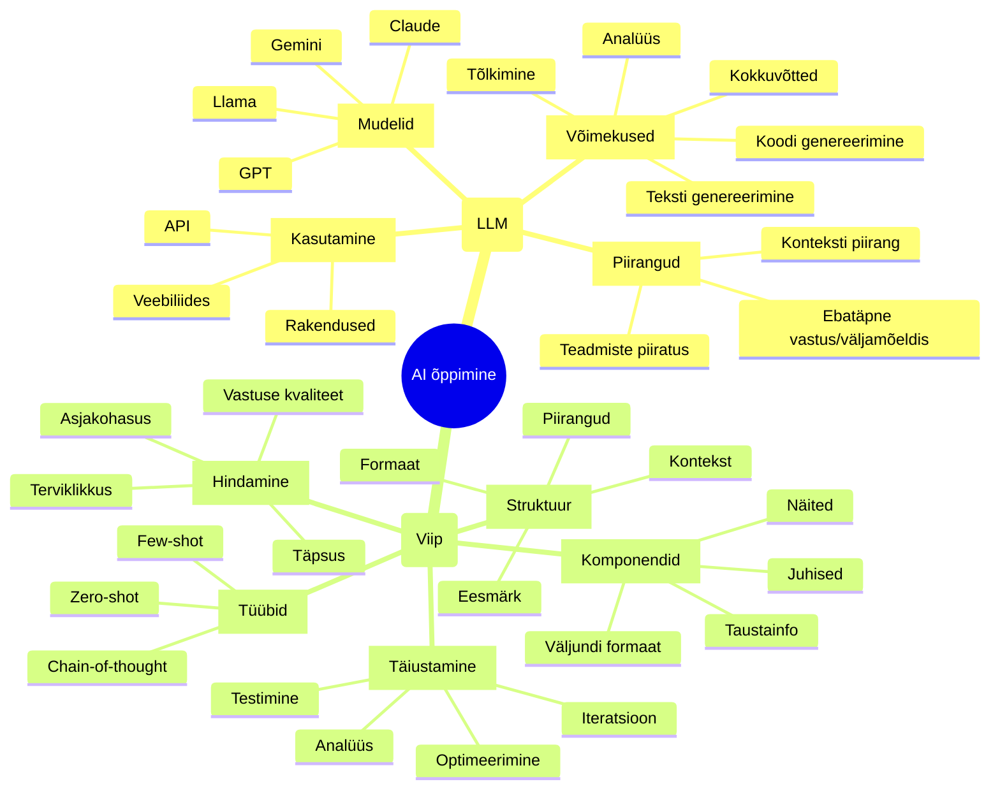

# Üle jäänud materjalid

```mermaid
mindmap
  root((AI õppimine))
    (LLM)
        [Mudelid]
            GPT
            Claude
            Llama
            Gemini
        [Võimekused]
            Teksti genereerimine
            Analüüs
            Tõlkimine
            Kokkuvõtted
            Koodi genereerimine
        [Piirangud]
            Ebatäpne vastus/väljamõeldis
            Konteksti piirang
            Teadmiste piiratus
        [Kasutamine]
            API
            Veebiliides
            Rakendused
    (Viip)
        [Struktuur]
            Kontekst
            Eesmärk
            Piirangud
            Formaat
        [Tüübid]
            Zero-shot
            Few-shot
            Chain-of-thought
        [Komponendid]
            Taustainfo
            Juhised
            Näited
            Väljundi formaat
        [Täiustamine]
            Iteratsioon
            Analüüs
            Optimeerimine
            Testimine
        [Hindamine]
            Vastuse kvaliteet
            Täpsus
            Asjakohasus
            Terviklikkus
```